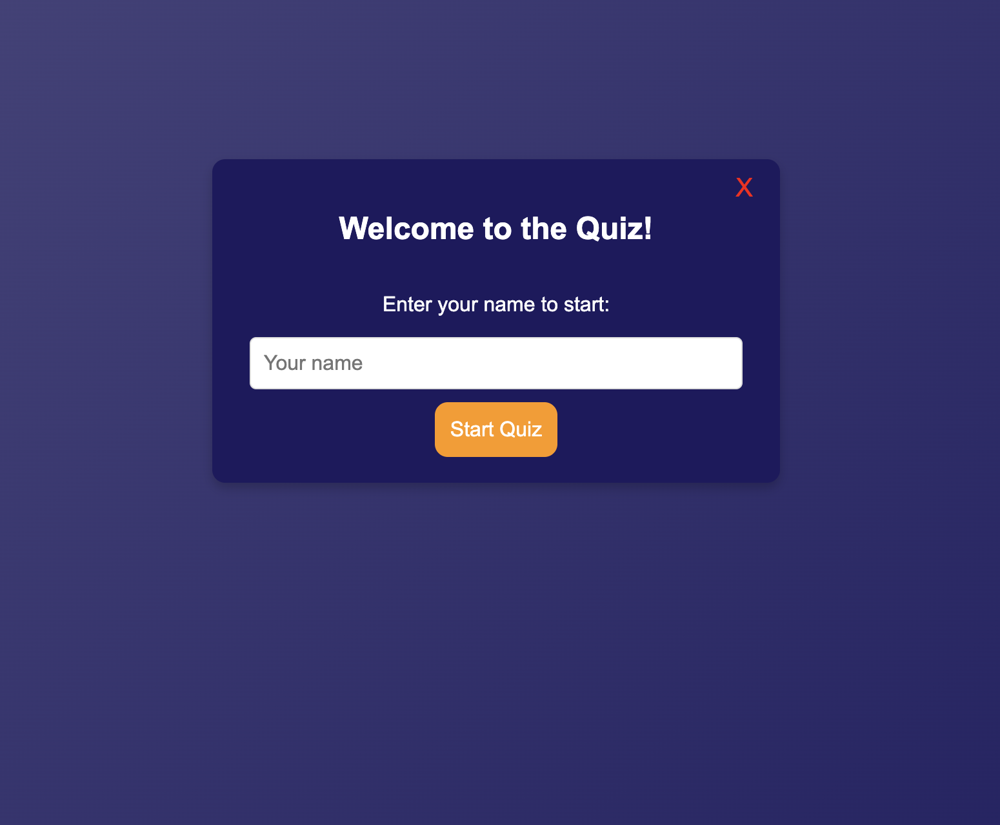

# Day 10: Build a Fun & Interactive Quiz App!

## 📌 Project Overview
This project is a **simple quiz app** built using **HTML, CSS, and JavaScript**. Users can test their knowledge by answering multiple-choice questions, track their progress with a **progress bar**, and restart the quiz after completion.

## 🎯 Features
- 🚀 **6+ Multiple Choice Questions**
- 🎨 **Styled with a gradient background (black & purple)**
- 🟠 **Progress bar to track quiz completion**
- 🟣 **Dark purple question text for readability**
- 🏆 **Next button with improved design & reduced height**
- 🔄 **Restart button to retake the quiz**
- ❌ **Close (X) button to exit the quiz**

## 🛠️ Technologies Used
- **HTML** – Structure of the quiz
- **CSS** – Styling and animations
- **JavaScript** – Quiz logic, tracking scores, and interactivity

---

# Demo page

Click [Here](https://ayshasanyang.github.io/Day-10-simple-quiz-app/) to view the page

## 🚀 How to Run
1. Download or clone the repository
```bash
git clone https://github.com/ayshasanyang/Day-10-simple-quiz-app.git
```
2. Navigate to the project folder.
3. Open the project files in your vscode or any code editor of your choice
4. Open the `index.html` file in your web browser.

---
## 📸 Screenshots


## 📢 How to Use
1. **Enter your name** to start the quiz.
2. **Answer questions** by selecting an option.
3. Click the **Next button** to move to the next question.
4. The **progress bar** updates as you progress.
5. **Restart** the quiz or **exit** using the close (X) button.

## 📢 Connect

If you enjoyed this project, let me know! Follow me on social media to see more coding content:

- Instagram: [@codewithaysha](#)
- TikTok: [@Aysha](#)

---
